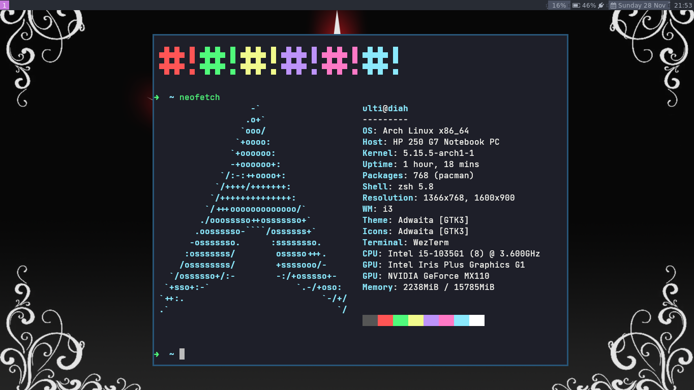

# Dotfiles

> Window Manager: [i3](https://github.com/Airblader/i3) -
> Status Bar: [bumblebee-status](https://github.com/tobi-wan-kenobi/bumblebee-status)

My current OS is [Archlinux](https://archlinux.org),
and I'm quite satisfied with it so I don't plan on changing it anytime soon.

## Inspiration :heart: :earth_americas:

- Miloš Sutanovac's [dotfiles](https://github.com/mixn/dotfiles)

## Shell

My current shell is [zsh](https://zsh.org),
with [Oh my Zsh](https://ohmyz.sh) as framework.

### License

Take anything you want from here, [MIT](./license).
