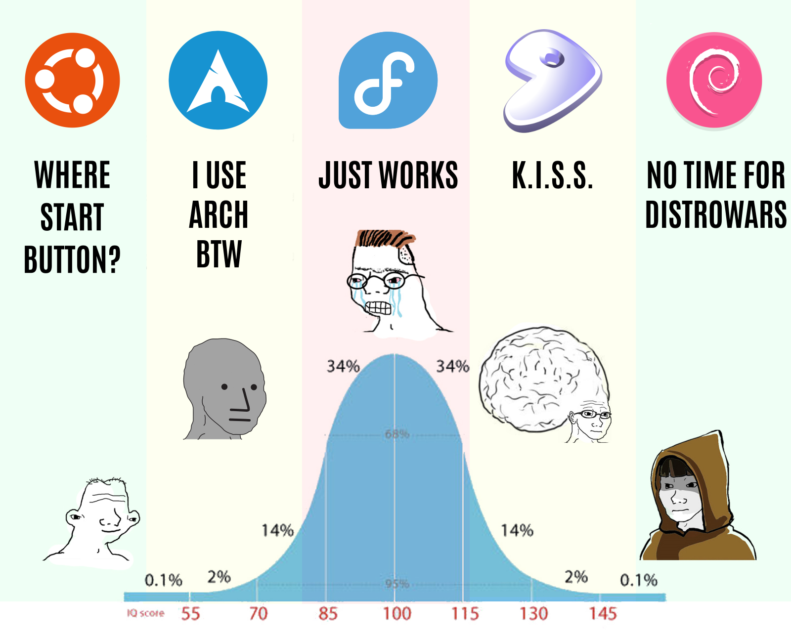

# my home

Currently using Ubuntu.



Ubuntu: ~ 1 year / Debian: 2 years / Arch: 4 years / Fedore: ~0.5 years

Proud archlinux user for the homies, ubuntu/debian for work

## Development

## Git config

```sh
git config --global user.email "eliaz.bobadilladev@gmail.com"
git config --global user.name "Eliaz Bobadilla

ssh-keygen -t ed25519 -C "eliaz.bobadilladev@gmail.com"
eval "$(ssh-agent -s)"
ssh-add ~/.ssh/id_ed25519

cat ~/.ssh/id_ed25519.pub
```

### Flutter

> https://docs.flutter.dev/get-started/install/linux/android#add-flutter-to-your-path

```sh
sudo apt-get update -y && sudo apt-get upgrade -y;

apt install -y libc6:amd64 libstdc++6:amd64 lib32z1 libbz2-1.0:amd6 libgtk-3-dev ninja-build cmake clang  libglu1-mesa;
```

## Software

```sh
sudo apt install ranger git curl zip unzip xz-utils
```

### Neovim

```sh
sudo add-apt-repository ppa:neovim-ppa/unstable && sudo apt-get update && sudo apt-get install neovim
```

### VSCode

> https://code.visualstudio.com/docs/setup/linux#_install-vs-code-on-linux

### Wezterm

> https://wezterm.org/install/linux.html#using-the-apt-repo

```sh
curl -fsSL https://apt.fury.io/wez/gpg.key | sudo gpg --yes --dearmor -o /etc/apt/keyrings/wezterm-fury.gpg
echo 'deb [signed-by=/etc/apt/keyrings/wezterm-fury.gpg] https://apt.fury.io/wez/ * *' | sudo tee /etc/apt/sources.list.d/wezterm.list
sudo apt update && sudo apt install wezterm
```

### Spotify

> https://www.spotify.com/uk/download/linux

```sh
curl -sS https://download.spotify.com/debian/pubkey_C85668DF69375001.gpg | sudo gpg --dearmor --yes -o /etc/apt/trusted.gpg.d/spotify.gpg
echo "deb http://repository.spotify.com stable non-free" | sudo tee /etc/apt/sources.list.d/spotify.list
sudo apt-get update && sudo apt-get install spotify-client
```
